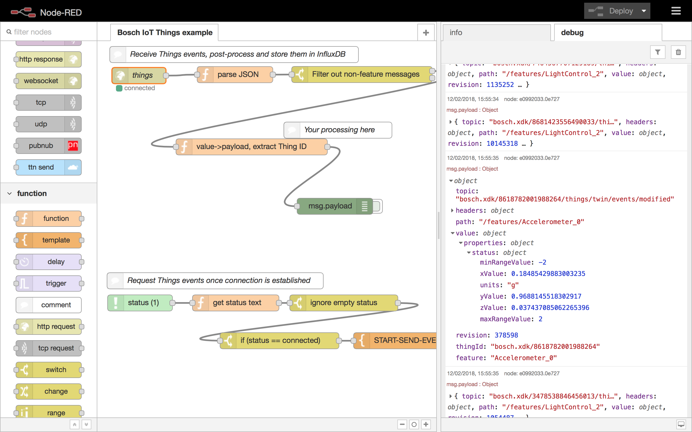

# Bosch IoT Things :: Node-RED example client

This example connects to Bosch IoT Things using a Websocket connection. In order to use it, copy the contents of [NodeRED-Example.json](NodeRED-Example.json) into your clipboard and paste it into a Node-RED instance. Then, you need to adapt the credentials in the top-left websocket node, filling in tenant name, user id, password, and API token.

