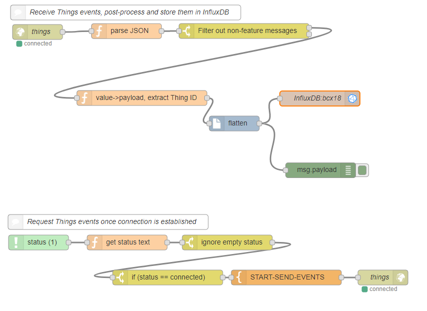
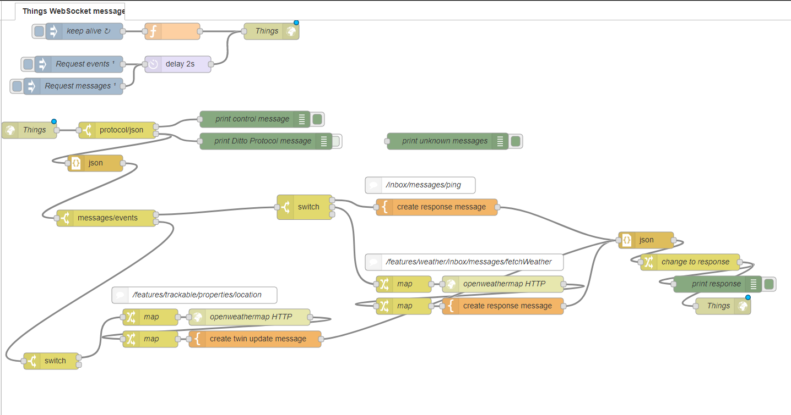

# Bosch IoT Things :: Node-RED examples

The examples connects to Bosch IoT Things using a WebSocket connection.

In order to use it, copy the contents of the Node-RED flow into your clipboard and paste it into a Node-RED instance.

Then, you need to adapt the credentials in the websocket node, filling in tenant name, user id, password, and API token.


## [InfluxDB example](influxdb)

This NodeRED example connects to the Bosch IoT Things WebSocket and does the following:

Prepares inserting events consumed from Bosch IoT Things into an InfluxDB.




## [Messages response example](message)

This NodeRED example connects to the Bosch IoT Things WebSocket and does the following:

### Enhance the API of Digital Twins by fetching weather



Messages sent to Things on the HTTP resource `POST /api/2/<thingId>/features/weather/inbox/messages/fetchWeather`
and with the payload

```json
{
    "city": "Berlin",
    "country": "de"
}
```

are handled by calling an external weather service which returns the current weather
for the provided location. Bosch IoT Things will correlate HTTP response to the request
and answer with the current weather for the passed location.

Be aware that the user you use for connecting to the WebSocket needs to have `READ` permission for
this specific message.


### Registers on location changes and updates the weather

This example also reacts on changes on the path `/features/trackable/properties/location`.
Every time the `latitude` and `longitude` are changed, it fetches the current weather
for that location and updates the `/features/weather/properties/current` property
of the same Thing which had the location change.

Be aware that the user you use for connecting to the WebSocket needs to have `READ` permission for
the `location` property of the `trackable` feature and needs to have `WRITE` permission
on the `current` property of the `weather` feature in order to update the weather.
